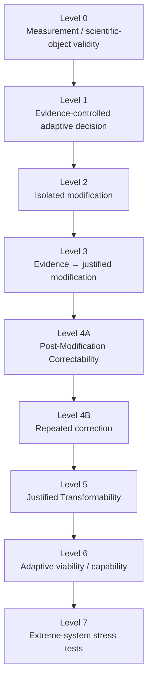
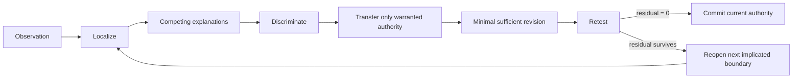

# Correction-Capable Adaptation

> **Can an adaptive system become more capable while preserving its capacity to incorporate justified correction?**

CCA is a research program about **warranted change under preserved corrigibility**. It studies how evidence can acquire causal control, how consequential modification can remain scientifically identified, and how a system can preserve or reconstitute the conditions required for future justified correction.

The governing discipline is simple:

\[
\boxed{\textbf{Maximum ambition; minimum unearned authority.}}
\]

And the repository itself follows the same rule:

\[
\boxed{\textbf{Commit hard. Preserve lineage. Reopen on evidence.}}
\]

---

## The Kintsugi repository

CCA does not hide its fractures.

Negative results, abandoned constructions, repaired definitions, revised rules, and reopened assumptions remain visible as scientific lineage. A correction creates a successor; it does not manufacture a cleaner past.

```text
PAST      preserve
PRESENT   commit
FUTURE    reopen on evidence
```

This is **local closure + global reopenability**:

- a local attack stops when no discriminating residual remains;
- a current rule can bind without becoming sacred;
- a frozen contract preserves one experiment's identity;
- a closed result remains historically immutable;
- future evidence may reopen the surrounding science through explicit descendants or amendments.

\[
\boxed{\text{historical immutability}\neq\text{epistemic irreversibility}}
\]

See **[Kintsugi](KINTSUGI.md)** and **[Research Returnability](methodology/RESEARCH_RETURNABILITY.md)**.

---

## At a glance

| Object | Current authority | Empirical status |
| --- | --- | --- |
| **G1** — warranted evidence control over a separable adaptive decision | Role provisionally fixed / reopenable | Untested; contract unfrozen |
| **CCA causal composition principle** | Canonical current methodological rule / reopenable | Governs future causal claims |
| **PMC** — Post-Modification Correctability | Role provisionally fixed / reopenable | Untested; metric/contract unfrozen |
| **Repeated correction** | Conceptually distinct from PMC | Untested |
| **JT** — Justified Transformability | Role provisionally fixed / reopenable | Warrant/distinctness semantics under review |
| **Adaptive viability / capability** | Downstream research target | Not authorized |
| **AGI / recursive improvement / ASI** | Stress-test regimes only | Not authorized |

**No new empirical execution is currently authorized.** The machine-readable source of truth is [`research_state.json`](research_state.json).

---

## Scientific spine



This ladder is an **evidence-ordering policy**, not automatically a universal metaphysical decomposition of adaptive systems.

A failed upstream prerequisite blocks authority downstream. Progress is not an average score.

---

## Core scientific rules

### 1. Never infer downstream capability from an unvalidated upstream mechanism

A successful endpoint cannot rescue an unidentified path.

### 2. Validated endpoints do not validate the pathway

CCA canonically adopts:

> **A downstream causal claim may not inherit authority from an upstream validated relation across a separable transformation unless that transformation is independently identified, prospectively specified and validated as an apparatus guarantee, or explicitly excluded from the claim.**

\[
\boxed{\text{validated endpoints}\not\Rightarrow\text{validated pathway}}
\]

Decision record: [`lineage/decisions/CCA_CAUSAL_COMPOSITION_PRINCIPLE.md`](lineage/decisions/CCA_CAUSAL_COMPOSITION_PRINCIPLE.md).

### 3. Localize before escalating

CCA uses the shallowest sufficient failure locus and revises only what the evidence reaches.

\[
\boxed{\text{redescription}\neq\text{re-localization}}
\]

A deeper explanation does not earn revision authority merely because it is more general.

### 4. Reopenability does not erase commitment

Current authority remains operative until new discriminating evidence reaches it.

\[
\boxed{\text{current authority}\neq\text{permanent immunity from revision}}
\]

---

## The current scientific objects

### G1 — warranted causal evidence control

CCA's first empirical pathway is currently instantiated as candidate selection:

\[
\boxed{G_1=\text{warranted evidence acquiring causal control over a separable adaptive decision}}
\]

Candidate selection is an operational instantiation, **not** a universal architecture of correction.

Decision record: [`lineage/decisions/G1_LEVEL0_ROLE.md`](lineage/decisions/G1_LEVEL0_ROLE.md).

### PMC — capacity survived is not capacity exercised

Post-Modification Correctability asks:

> **After a consequential change, do the conditions required for future warranted correction remain available?**

CCA preserves:

\[
\boxed{\mathrm{PMC}\neq\mathrm{Repeated\ Correction}}
\]

or:

\[
\boxed{\text{capacity survived}\neq\text{capacity exercised}}
\]

A realized repeated correction provides only opportunity-local evidence unless broader future-correction scope is independently established.

Decision records:

- [`lineage/decisions/POST_MODIFICATION_CORRECTABILITY_ROLE.md`](lineage/decisions/POST_MODIFICATION_CORRECTABILITY_ROLE.md)
- [`lineage/decisions/PMC_REPEATED_CORRECTION_DISTINCTION.md`](lineage/decisions/PMC_REPEATED_CORRECTION_DISTINCTION.md)

### JT — trajectory evidence is not repertoire evidence

Justified Transformability asks:

> **What prospectively relevant warranted transformations remain reachable, and can materially different warranted destinations be reached while preserving or reconstituting future correction conditions?**

CCA currently distinguishes:

\[
\boxed{\mathrm{PMC}=\text{availability}}
\]

\[
\boxed{\mathrm{RepeatedCorrection}=\text{realized temporal exercise}}
\]

\[
\boxed{\mathrm{JT}=\text{warranted transformation repertoire}}
\]

Therefore:

\[
\boxed{\text{trajectory evidence}\neq\text{repertoire evidence}}
\]

and:

\[
\boxed{\text{many reachable states}\not\Rightarrow\text{many warranted transformations}}
\]

JT's warrant, material-distinctness, target-family, preservation/reconstitution, reachability, counterfactual-availability, metric, and empirical-contract semantics remain unfrozen.

Decision record: [`lineage/decisions/JUSTIFIED_TRANSFORMABILITY_ROLE.md`](lineage/decisions/JUSTIFIED_TRANSFORMABILITY_ROLE.md).

---

## Current frontier

### Empirical authority frontier

**G1 remains empirically untested.** No G1 experiment contract is frozen and no empirical execution is authorized.

### Conceptual frontier

> **Can the warrant, distinctness, repertoire, preservation, target-family, and counterfactual-availability semantics of Justified Transformability be specified without retrospective approval, trivial-difference inflation, or benchmark-defined reachability?**

The frontier is conceptual. It does not authorize implementation.

---

## How CCA changes its mind



This is CARS: [`CARS.md`](CARS.md).

The repository-level companion is research returnability:

> **Open the smallest boundary implicated by new discriminating evidence; revise what the evidence reaches; preserve everything not implicated; and preserve a warranted path for later reopening.**

---

## The evidence lineage

CCA treats negative results as scientific structure, not clutter.

The public lineage records:

```text
ancestor
→ observation
→ authority gained
→ authority not gained
→ diagnosis
→ descendant or closure
```

The central ledger is [`lineage/EVIDENCE_LEDGER.md`](lineage/EVIDENCE_LEDGER.md).

Current adversarial provenance includes:

```text
#3–#8   G1 scientific-object attacks
#9–#10  causal-composition attacks
#11     PMC scientific-object attack
#12     PMC versus repeated correction
#13     repeated correction versus Justified Transformability
```

These are provenance, not empirical experiments.

---

## Read the repository

| If you want to understand… | Start here |
| --- | --- |
| **The scientific question and dependency graph** | [`SCIENTIFIC_OBJECT.md`](SCIENTIFIC_OBJECT.md) |
| **How CCA responds to contradictions** | [`CARS.md`](CARS.md) |
| **How the repo stays corrigible without rewriting history** | [`KINTSUGI.md`](KINTSUGI.md) → [`methodology/RESEARCH_RETURNABILITY.md`](methodology/RESEARCH_RETURNABILITY.md) |
| **Lifecycle and execution authority** | [`methodology/RESEARCH_STATE_MACHINE.md`](methodology/RESEARCH_STATE_MACHINE.md) |
| **Methodology map** | [`methodology/README.md`](methodology/README.md) |
| **Current authority state** | [`RESEARCH_STATE.md`](RESEARCH_STATE.md) / [`research_state.json`](research_state.json) |
| **What evidence has actually been earned** | [`lineage/EVIDENCE_LEDGER.md`](lineage/EVIDENCE_LEDGER.md) |
| **How experiments must be prospectively constituted** | [`contracts/README.md`](contracts/README.md) |
| **Provisional higher-order theory** | [`MAGIKARP.md`](MAGIKARP.md) |

---

## What this repository refuses to do

CCA does not:

- repair a closed negative result by changing its estimand after the outcome;
- treat representation robustness, accuracy, or endpoint success as substitutes for the causal object under test;
- infer broad capacity from one realized trajectory;
- treat a large reachable state space as a warranted repertoire;
- call apparatus-supplied transformations system competence;
- use `canonical` or `frozen` to mean immune from future evidence;
- reopen a successful localization merely because a deeper abstraction is available;
- turn AGI or ASI into foundational assumptions before upstream scientific objects earn authority.

---

## Ultimate question

\[
\boxed{\textbf{Can increasing adaptive power preserve—or improve—the ability to change for reasons that remain justified?}}
\]

**Nothing scientific is permanently frozen. Nothing historical is silently rewritten. Every claim must still earn exactly the authority it uses.**
